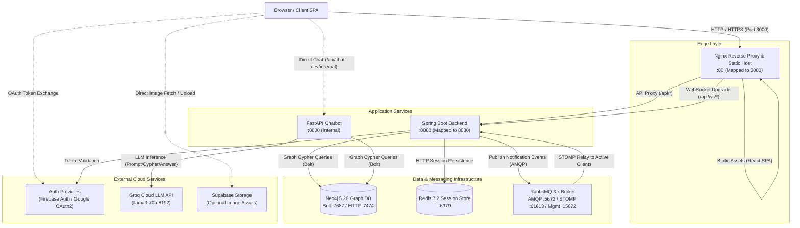
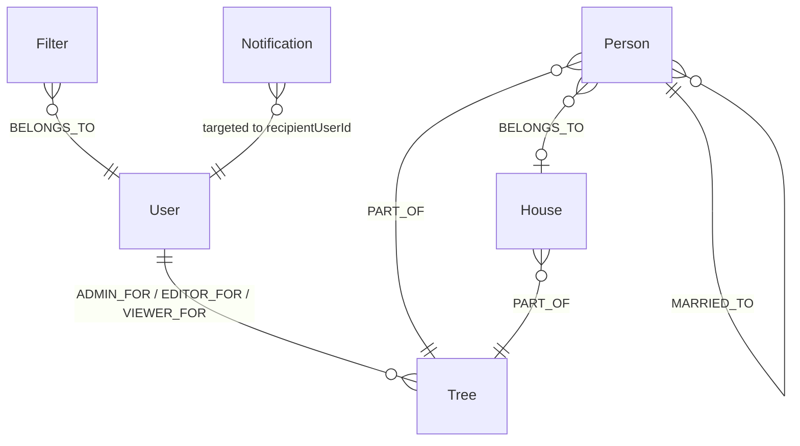
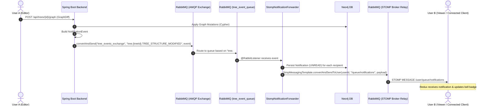
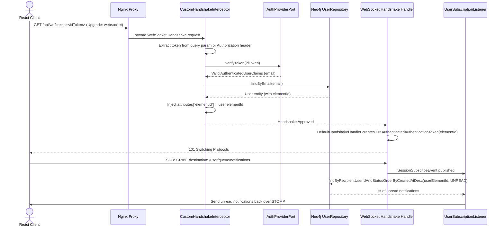
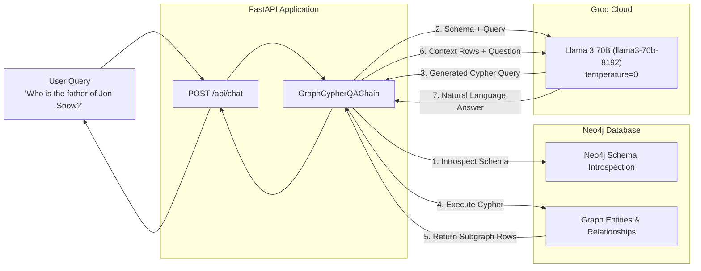

# Family Tree System Architecture

This document provides a comprehensive architectural specification of the Family Tree platform—a polyglot, distributed system designed for building, visualising, collaborating on, and querying rich genealogical graphs with real-time updates and AI conversational capabilities.

---

## 1. System Topology & High-Level Architecture

The platform follows a distributed, service-oriented architecture containerized with **Podman Compose** (or Docker Compose) comprising six primary services connected over a private bridge network (`backendnet`).



### Component Roles & Port Allocations

| Component | Technology | Host Port | Internal Port | Primary Responsibility |
|---|---|---|---|---|
| **Frontend** | React 18, TypeScript, Webpack, MUI, React Flow | `3000` (`$FRONTEND_PORT`) | `80` | Serves client SPA and proxies API & WebSocket connections |
| **Backend** | Spring Boot 3.4.5, Java 17 | `8080` (`$SPRING_PORT`) | `8080` | Core REST APIs, business logic, security, graph operations, and WebSocket STOMP endpoint |
| **Chatbot** | Python 3.11, FastAPI, LangChain | `8000` | `8000` | Natural language question answering over the Neo4j graph using Groq LLM |
| **Neo4j** | Neo4j Community 5.26.0 | `7474`, `7687` | `7474`, `7687` | Persistent property graph database storing Users, Trees, Persons, Houses, Filters, and Notifications |
| **Redis** | Redis 7.2 Alpine | `6379` | `6379` | Distributed HTTP session store via `spring-session-data-redis` |
| **RabbitMQ** | RabbitMQ 3-management (with STOMP) | `5672`, `15672` | `5672`, `61613`, `15672` | AMQP event bus for tree events and STOMP message broker relay for WebSocket push |

---

## 2. Backend Architecture (`familytree/`)

The backend is built with **Spring Boot 3.4** and Java 17 using Gradle. It adheres to **Ports and Adapters (Hexagonal Architecture)** principles, particularly around external identity integrations, decoupling core business logic from specific authentication providers.

```mermaid
graph TB
    subgraph Inbound Web Layer
        AC["AuthController<br/>/api/auth/*"]
        TC["TreeController<br/>/api/trees/*"]
        PC["PersonController<br/>/api/trees/{id}/persons/*"]
        GC["GraphController<br/>/api/trees/{id}/graph/*"]
        FC["FilterController<br/>/api/filters/*"]
        HC["HouseController<br/>/api/trees/{id}/houses/*"]
        NC["NotificationController<br/>/api/notifications/*"]
        UC["UserController<br/>/api/users/*"]
    end

    subgraph Security & Interceptors
        SecConfig["SecurityConfig<br/>(Session Creation, CSRF, AuthorizeRequests)"]
        CommUtils["CommonUtils<br/>(AccessCheck, SecurityContext)"]
        WSHS["CustomHandshakeInterceptor<br/>(Token Validation & Principal Attribution)"]
    end

    subgraph Application Service Layer
        US["UserService"]
        UTS["UserTreeService"]
        GS["GraphService"]
        FS["FilterService"]
        PS["PersonService"]
        HS["HouseService"]
        NS["NotificationService<br/>(AMQP Publisher)"]
        NMS["NotificationManagementService"]
        SNF["StompNotificationForwarder<br/>(@RabbitListener Consumer)"]
        USL["UserSubscriptionListener<br/>(Pending Notifications On Connect)"]
    end

    subgraph Domain & Hexagonal Ports
        APP["AuthProviderPort<br/>(verifyToken, getProviderName)"]
        AUC["AuthenticatedUserClaims"]
    end

    subgraph Infrastructure Adapters
        FBAdapter["FirebaseAuthProviderAdapter<br/>(Firebase Admin SDK)"]
        GAdapter["GoogleAuthProviderAdapter<br/>(Google ID Token Verifier)"]
        AuthCfg["AuthAdapterConfig<br/>(@Primary switch via AUTH_PROVIDER)"]
    end

    subgraph Repositories & Data Access
        UR["UserRepository"]
        TR["TreeRepository"]
        PR["PersonRepository"]
        HR["HouseRepository"]
        NR["NotificationRepository"]
        FLR["FilterRepository"]
        NCli["Neo4jClient<br/>(Custom Cypher Executions)"]
    end

    AC --> SecConfig
    AC --> US
    AC --> CommUtils
    TC & PC & GC & FC & HC & NC & UC --> CommUtils
    
    US --> APP
    AuthCfg -->|Selects| FBAdapter
    AuthCfg -->|Selects| GAdapter
    FBAdapter & GAdapter -.->|Implements| APP
    APP --> AUC

    WSHS --> APP
    WSHS --> UR

    UTS --> TR & UR & NCli & NS
    GS --> TR & UR & NCli & NS
    NS -->|AMQP convertAndSend| RabbitMQ
    SNF -->|@RabbitListener| RabbitMQ
    SNF --> NR & SimpMessagingTemplate
    USL --> NR & SimpMessagingTemplate
```

### 2.1 Pluggable Authentication Architecture (Ports & Adapters)

The platform supports multiple OAuth providers with zero application logic divergence:

```
[ Frontend: Firebase Client SDK / Google One Tap ]
                      │
            POST /api/auth/login { token: "..." }
                      │
                      ▼
               [ AuthController ]
                      │
                      ▼
               [ UserService ]
                      │
                      ▼
              [ AuthProviderPort ]  ◄── (Domain Port Interface)
             ┌────────┴────────┐
             ▼                 ▼
   [ FirebaseAuthAdapter ]   [ GoogleAuthAdapter ]
  (Firebase Admin SDK 9.3)   (Google API Client 2.8)
             └────────┬────────┘
                      ▼
          [ AuthenticatedUserClaims ]
                      │
                      ▼
       Lookup or Create [ User ] in Neo4j
                      │
                      ▼
     Spring SecurityContext Authenticated
           (Principal = User.elementId)
                      │
                      ▼
      Session Written to Redis (TTL configurable)
```

- **Configuration Flag**: `AUTH_PROVIDER=FIREBASE` or `AUTH_PROVIDER=GOOGLE` in `.env`.
- **Dynamic Selection**: Both adapter beans are instantiated by Spring; `AuthAdapterConfig` marks the configured provider with `@Primary`.
- **Identity Unification**: Both adapters parse claims into `AuthenticatedUserClaims` (`email`, `name`, `picture`, `uid`, `provider`).
- **Security Principal**: `SecurityContextHolder` stores `UsernamePasswordAuthenticationToken` where the principal is the Neo4j `User.elementId` (not email or Google UID). All services query the database via this immutable identifier.

### 2.2 Role-Based Access Control (RBAC)

Tree access permissions are governed at the database level through relationships between `User` and `Tree` nodes:

| Role | Neo4j Relationship | Permissions |
|---|---|---|
| **ADMIN** | `(User)-[:ADMIN_FOR]->(Tree)` | Complete control: mutate graph, invite users, update user roles, delete tree. |
| **EDITOR** | `(User)-[:EDITOR_FOR]->(Tree)` | Graph mutation: add, update, and delete Persons, Houses, and relationships. Cannot alter user access or delete the tree. |
| **VIEWER** | `(User)-[:VIEWER_FOR]->(Tree)` | Read-only: view graph, inspect profiles, run queries and filters. |

- **Access Enforcement**: Centralized in `CommonUtils.accessCheck(treeId, Role[] requiredRoles)`.
- **Relationship Resolution**: Resolved dynamically via `userRepo.findRelationshipBetweenUserAndTree(userElementId, treeElementId)`.

---

## 3. Neo4j Graph Data Model

The core domain model is stored natively in **Neo4j 5.26** using labeled nodes and typed directional relationships.



### 3.1 Node Labels & Schema

#### `User`
Represents an authenticated user account.
- `elementId` *(String, @Id)*: Neo4j unique element identifier (e.g. `4:12979c35-eb38-4bad-b707-8478b11ae98e:12`).
- `email` *(String)*: Unique user email address.
- `name` *(String)*: Display name.
- `picture` *(String)*: Profile picture URL from OAuth provider.

#### `Tree`
Represents an individual family tree project.
- `elementId` *(String, @Id)*: Neo4j element identifier.
- `name` *(String)*: Tree name.
- `desc` *(String)*: Narrative description of the tree.
- `createdAt` *(String)*: ISO 8601 creation timestamp.
- `createdBy` *(String)*: `elementId` of the creator user.

#### `Person`
Represents an individual within a family tree.
- `elementId` *(String, @Id)*: Neo4j element identifier.
- `name` *(String)*: Full name.
- `gender` *(String)*: Gender identity (`male`, `female`, other).
- `nickName` *(String)*: Informal name / moniker.
- `isAlive` *(String / Boolean)*: Living status.
- `dob` *(Date)*: Date of birth.
- `doe` *(Date)*: Date of expiry / death.
- `currLocation` *(String)*: Current place of residence.
- `imageUrl` *(String)*: Profile photo URL (Supabase or external).
- `character` *(String)*: Optional personality traits / notes.
- Embedded properties (flattened in Neo4j, structured in DTO):
  - `Education` (`degree`, `institution`, `fieldOfStudy`, `startYear`, `endYear`)
  - `Job` (`title`, `company`, `location`, `jobType`, `startYear`, `endYear`)

#### `House`
Represents an ancestral house, lineage, or family branch (inspired by dynasty/house structures).
- `elementId` *(String, @Id)*: Neo4j element identifier.
- `name` *(String)*: House or family name (e.g., House Stark).
- `gods` *(String)*: Family faith or deities (optional).
- `hometown` *(String)*: Place of origin / ancestral seat.
- `sigil` *(String)*: Sigil / crest description or asset path.
- `words` *(String)*: Motto / house words.

#### `Notification`
Audit record of an event sent to a specific user.
- `internalId` *(Long, @GeneratedValue)*: Neo4j auto-generated ID.
- `eventId` *(String)*: UUID matching the originating `NotificationEvent`.
- `recipientUserId` *(String)*: `elementId` of the target recipient.
- `eventType` *(EventType enum)*: `TREE_CREATED`, `TREE_DELETED`, `TREE_STRUCTURE_MODIFIED`, `USER_ACCESS_CHANGED`.
- `treeId` *(String)*: Associated tree identifier.
- `treeName` *(String)*: Name of the associated tree.
- `actorUserId` *(String)*: `elementId` of the user who triggered the event.
- `actorUserName` *(String)*: Name of the actor.
- `messagePayload` *(String)*: Serialized JSON detailing modified counts or context.
- `status` *(NotificationStatus enum)*: `UNREAD` or `READ`.
- `createdAt`, `updatedAt` *(LocalDateTime)*.

#### `Filter`
Saved user query configurations for isolating subgraphs.
- `elementId` *(String, @Id)*: Neo4j element identifier.
- `filterName` *(String)*: User-defined filter title.
- `enabled` *(boolean)*: Active toggle state.
- `filterBy` *(Nested Object)*: Edge visibility toggles, node property bounds (age range, alive, locations, jobs, studies), and root person centering with `onlyImmediate` switch.

### 3.2 Relationship Types

| Relationship | Start Node | End Node | Semantics |
|---|---|---|---|
| `ADMIN_FOR` | `User` | `Tree` | User has administrative ownership of Tree |
| `EDITOR_FOR` | `User` | `Tree` | User has write/edit permissions on Tree |
| `VIEWER_FOR` | `User` | `Tree` | User has read-only access to Tree |
| `PART_OF` | `Person` \| `House` | `Tree` | Scopes entity nodes to their parent Tree container |
| `PARENT_OF` | `Person` (Parent) | `Person` (Child) | Directed genealogical descent |
| `MARRIED_TO` | `Person` | `Person` | Bidirectional marriage / partner connection |
| `BELONGS_TO` | `Person` | `House` | Affiliation of an individual with an ancestral House |

### 3.3 Core Cypher Patterns

#### 1. Fetching Full Tree Graph
Scopes retrieval to elements linked to the tree via `PART_OF`:
```cypher
MATCH (m:Person | House)-[:PART_OF]->(proj:Tree)
WHERE elementId(proj) = $treeId
OPTIONAL MATCH (m)-[r:MARRIED_TO|PARENT_OF|BELONGS_TO]->(n)
RETURN n, r, m
```

#### 2. Subgraph / Family Ancestry Traversal
Traverses descendants to arbitrary or immediate depth, collecting spouses and houses:
```cypher
MATCH (root:Person)
WHERE elementId(root) = $elementId
OPTIONAL MATCH (root)-[spouseRel:MARRIED_TO]-(spouse:Person)
OPTIONAL MATCH path=(root)-[descendantRel:PARENT_OF*1..]->(descendant:Person)
OPTIONAL MATCH (descendant)-[descendantSpouseRel:MARRIED_TO]-(descendantSpouse:Person)
OPTIONAL MATCH (root)-[rootHouseRel:BELONGS_TO]-(rootHouse:House)
OPTIONAL MATCH (spouse)-[spouseHouseRel:BELONGS_TO]-(spouseHouse:House)
OPTIONAL MATCH (descendant)-[descendantHouseRel:BELONGS_TO]-(descendantHouse:House)
OPTIONAL MATCH (descendantSpouse)-[descSpouseHouseRel:BELONGS_TO]-(descSpouseHouse:House)
RETURN DISTINCT root, spouse, descendant, descendantSpouse, ...
```

#### 3. Graph Diff Update Execution
When the client saves modifications:
- **Node additions**: Generates nodes with property map and immediately establishes `(n)-[:PART_OF]->(t)`.
- **Dummy ID resolution**: Transient client IDs (e.g. `node_123456`) are mapped to Neo4j `elementId`s and reused when linking new edges in the same transaction.
- **Node deletions**: `MATCH (n) WHERE elementId(n) = $nodeId DETACH DELETE n`.

---

## 4. Real-time Event & Notification Architecture

The application implements a real-time push notification architecture integrating **Spring AMQP**, **RabbitMQ**, **SockJS**, and **STOMP Broker Relay**.



### 4.1 WebSocket Connection & Handshake Lifecycle



---

## 5. Frontend Architecture (`familyTreeUI/`)

The frontend is a single-page application built with **React 18** and **TypeScript**, bundled with **Webpack 5**, styled using **Material UI (MUI)** and **SCSS**, and visualized using **@xyflow/react** (React Flow).

```mermaid
graph TD
    subgraph UI Entry & Routing
        Index["index.html"] --> Main["main.tsx"]
        Main --> App["App.tsx (Routes: /, /trees/:treeId, /login)"]
        App --> PR["PrivateRoute"]
        PR --> Home["Home.tsx"]
    end

    subgraph State Management (Redux Toolkit)
        Store["app/store.ts"]
        TCS["treeConfigSlice<br/>(Graph nodes/edges, active diff, filter predicates)"]
        NS["notificationSlice<br/>(Notifications list, unread count, socket state)"]
        RTK["RTK Query Endpoints<br/>(auth, tree, graph, filter, user)"]
    end

    subgraph Realtime & Utilities
        WSM["WebSocketManager"]
        NSrv["notificationService.ts<br/>(@stomp/stompjs + SockJS)"]
        Layout["utils/layout.ts<br/>(Dagre graph auto-layout TB/LR)"]
        Diff["utils/common.ts<br/>(getDiff calculation)"]
    end

    subgraph View Components
        NavBar["Navbar (Profile, Tree Switcher, Notification Bell)"]
        TreeList["Trees (Tree Cards, Create Tree Dialog, Delete Batch)"]
        GraphFlow["GraphFlow.tsx (@xyflow/react)"]
        NodeDialog["NodeDialog (Person / House forms)"]
        EdgeDialog["EdgeDialog (Relationship type selector)"]
        FilterBar["Filter Panel (Multi-criteria node/edge filtering)"]
    end

    Home --> NavBar & TreeList & GraphFlow
    GraphFlow --> Layout & Diff & NodeDialog & EdgeDialog & FilterBar
    WSM --> NSrv
    NSrv --> NS
    GraphFlow --> TCS
    Home --> RTK
```

### 5.1 Interactive Graph Rendering & Diff Engine

The family tree interactive graph canvas is powered by `@xyflow/react` and a layout algorithm based on `dagre`:

1. **Auto-Layouting (`getLayoutedElements`)**:
   - Calculates directed acyclic / hierarchical positioning with configurable rank direction:
     - `TB` (Top to Bottom, generational descent).
     - `LR` (Left to Right).
   - Configures connection handles: Top/Bottom (`t1`/`b1`) or Left/Right (`l1`/`r1`).

2. **Graph Mutation Tracking (`getDiff`)**:
   - As nodes are added, positions moved, edges connected, or entities removed, the client computes a delta object (`GraphDiffDTO`):
     ```typescript
     interface GraphDiffDTO {
       addedNodes: FlowNodeDTO[];
       addedEdges: FlowEdgeDTO[];
       updatedNodes: FlowNodeDTO[];
       updatedEdges: FlowEdgeDTO[];
       deletedNodeIds: string[];
       deletedEdgeIds: string[];
     }
     ```
   - Only modified nodes and relationships are transmitted on save via `POST /api/trees/{treeId}/graph`.

3. **Multi-Faceted Filtering Engine**:
   - Allows users to isolate specific branches in complex trees.
   - Filters support:
     - Edge types: Toggle visibility of `PARENT_OF`, `MARRIED_TO`, `BELONGS_TO`.
     - Node types: Toggle `Person` or `House`.
     - Demographics: Age ranges, birth date boundaries, gender, living status.
     - Attributes: Professions/Job classifications, education/study qualifications, current geographical locations.
     - Focal person traversal: Center graph around a root individual, optionally constraining to immediate family.

---

## 6. AI Chatbot Architecture (`chatbot/`)

The repository includes an autonomous query chatbot built on **FastAPI**, **LangChain**, and **Groq Cloud**.



- **Framework**: `langchain-neo4j` `GraphCypherQAChain` paired with `ChatGroq`.
- **Model**: `llama3-70b-8192` at temperature 0 for deterministic Cypher generation.
- **Execution**: The chain directly introspects the Neo4j database schema, translates conversational queries into executable Cypher queries, runs them against the graph, and synthesizes natural-language answers.
- **Lifecycle Optimization**: The chain and graph connection are pre-warmed during FastAPI startup via lifespan handlers to eliminate cold-start latency.

---

## 7. Security & Session Model

```
┌─────────────────────────────────────────────────────────────┐
│                      HTTP Request                           │
└──────────────────────────────┬──────────────────────────────┘
                               │
                Matches /api/auth/** or /swagger-ui/** ?
                               ├───────────────► Permit All (No Session Required)
                               │
                               ▼
                   Is CSRF Valid? (_csrf / X-XSRF-TOKEN)
                               ├───────────────► If Invalid: 403 Forbidden
                               │
                               ▼
               Active Redis Session Present?
                               ├───────────────► If Missing/Expired: 401 Unauthorized
                               │
                               ▼
             Extract SecurityContext Principal (User.elementId)
                               │
                               ▼
             Method / Controller Access Check
             (e.g., CommonUtils.accessCheck(treeId, roles))
                               ├───────────────► If Role Missing: 403 Forbidden
                               ▼
                   Execute Controller Action
```

- **Session Store**: Spring Session backed by Redis. Sessions are shared across backend instances, maintaining high availability.
- **Session Timeout**: Configured via `REDIS_SESSION_TTL` (default 3600 seconds).
- **CSRF Protection**: Enabled using `CookieCsrfTokenRepository.withHttpOnlyFalse()`. The React frontend reads the `XSRF-TOKEN` cookie and transmits it via `X-XSRF-TOKEN` headers for state-changing HTTP and STOMP requests.
- **Public Endpoints**:
  - `/api/auth/**` (Login, Logout, Session check).
  - `/api/ws/**` (WebSocket handshake endpoint, authenticated via token in interceptor).
  - `/swagger-ui/**`, `/v3/api-docs/**`.

---

## 8. REST API Directory

### Authentication (`/api/auth`)
- `POST /api/auth/login`: Accepts ID token (`TokenRequest`), verifies claims, seeds user in Neo4j, establishes Redis session, returns `User`.
- `POST /api/auth/logout`: Invalidates HTTP session in Redis.
- `GET /api/auth/session`: Returns current session user details (`UserSessionDetailsDTO`) along with active ID token.

### Trees (`/api/trees`)
- `GET /api/trees/`: Lists all trees accessible by the authenticated user with role annotation.
- `GET /api/trees/{elementId}`: Retrieves metadata and role for a single tree (`VIEWER`, `EDITOR`, or `ADMIN`).
- `POST /api/trees/create`: Creates a new Tree node and establishes `ADMIN_FOR` relationship with caller.
- `POST /api/trees/{elementId}/addusers`: Invites/assigns users to a tree with specified roles (`ADMIN`).
- `POST /api/trees/{elementId}/updateusers`: Updates or revokes user roles on a tree (`ADMIN`).
- `DELETE /api/trees/{elementId}`: Deletes a tree and detaches all relationships (`ADMIN`).
- `POST /api/trees/delete-multiple`: Bulk deletion of trees (`ADMIN` check per tree).

### Graph (`/api/trees/{treeId}/graph`)
- `GET /api/trees/{treeId}/graph`: Returns full graph (`FlowGraphDTO` with nodes and edges) scoped by `PART_OF`.
- `GET /api/trees/{treeId}/graph/{elementId}/familytree?isImmediate={bool}`: Retrieves focused genealogical subgraph around a target person.
- `POST /api/trees/{treeId}/graph`: Applies `GraphDiffDTO` (batch node additions, updates, edge mutations, detach deletions). Emits `TREE_STRUCTURE_MODIFIED` notification event.

### Persons (`/api/trees/{treeId}/persons`)
- `GET /api/trees/{treeId}/persons/{elementId}`: Retrieves full person record by element ID.
- `POST /api/trees/{treeId}/persons`: Creates an unlinked person node.
- `GET /api/trees/{treeId}/persons/{elementId}/partners`: Retrieves `MARRIED_TO` partners.
- `GET /api/trees/{treeId}/persons/{elementId}/children`: Retrieves `PARENT_OF` outgoing nodes.
- `GET /api/trees/{treeId}/persons/{elementId}/siblings`: Calculates siblings sharing parentage.
- `GET /api/trees/{treeId}/persons/{elementId}/house`: Retrieves house associated via `BELONGS_TO`.

### Houses (`/api/trees/{treeId}/houses`)
- `GET /api/trees/{treeId}/houses/{elementId}`: Retrieves house details by element ID.
- `POST /api/trees/{treeId}/houses`: Creates a new house entity.

### Filters (`/api/filters`)
- `POST /api/filters/create?treeId={id}`: Saves custom filter criteria for user and tree.
- `GET /api/filters/?treeId={id}`: Fetches all saved filters for user and tree.
- `POST /api/filters/{filterId}/update`: Updates filter configuration.
- `DELETE /api/filters/delete-multiple`: Deletes selected filters.

### Notifications (`/api/notifications`)
- `GET /api/notifications`: Retrieves all notification entities for the user.
- `POST /api/notifications/{eventId}/read`: Marks notification as read.
- `POST /api/notifications/{eventId}/unread`: Reverts notification to unread.
- `POST /api/notifications/read-all`: Marks all notifications as read.
- `POST /api/notifications/unread-batch`: Batch updates status to unread.
- `DELETE /api/notifications/{eventId}`: Deletes notification.
- `DELETE /api/notifications/delete-all-read`: Cleans up all read notifications.

### Users (`/api/users`)
- `GET /api/users/`: Lists all registered users in the platform.
- `GET /api/users/{treeId}`: Lists users assigned to a tree with their current role.

### Chatbot (`/api/chat` - Port 8000)
- `POST /api/chat`: Accepts `{"message": "..."}`, returns `{"reply": "..."}`.
- `GET /health`: Health status endpoint.

---

## 9. Container & Deployment Topology

### Compose Service Definition Summary

```yaml
services:
  frontend:
    build: ./familyTreeUI
    ports: ["3000:80"]
    volumes: [./nginx/default.conf:/etc/nginx/conf.d/default.conf:ro]
    depends_on: [backend]
    networks: [backendnet]

  backend:
    build: ./familytree
    ports: ["8080:8080"]
    env_file: [.env]
    depends_on: [neo4j, redis, rabbitmq]
    networks: [backendnet]

  rabbitmq:
    image: rabbitmq:3-management
    ports: ["5672:5672", "15672:15672"]
    volumes:
      - rabbitmq-data:/var/lib/rabbitmq
      - ./rabbitmq/enabled_plugins:/etc/rabbitmq/enabled_plugins:ro
    networks: [backendnet]

  neo4j:
    image: neo4j:5.26.0
    ports: ["7474:7474", "7687:7687"]
    volumes: [neo4j-data:/data]
    networks: [backendnet]

  redis:
    image: redis:7.2-alpine
    ports: ["6379:6379"]
    volumes: [redis-data:/data]
    networks: [backendnet]

  chatbot:
    build: ./chatbot
    ports: ["8000:8000"]
    env_file: [.env]
    depends_on: [neo4j]
    networks: [backendnet]
```

### Build & Run Pipeline (`buildAndRun.py`)
1. Cleans stale frontend bundles in `familyTreeUI/dist`.
2. Executes `npm install` and `npm run build` (Webpack transpilation via Babel, generating `bundle.js` and `index.html`).
3. Invokes `podman-compose down`.
4. Executes `podman-compose up --build -d` to restart services with updated container layers.

---

## 10. Architectural Invariants & Development Rules

When extending or maintaining this codebase, adhere to the following architectural rules:

1. **Authentication Independence**:
   - Never couple controller or service code directly to Firebase or Google SDK classes.
   - Always route token verification through `AuthProviderPort`.
   - Security principals must always resolve to `User.elementId`.

2. **Graph Consistency**:
   - Any new entity belonging to a tree must maintain a `[:PART_OF]->(Tree)` relationship.
   - All relationship type strings must be declared as constants in `Constants.java`.
   - Any graph mutation that changes structure must trigger a `NotificationEvent` via `NotificationService`.

3. **Frontend Bundling Rules**:
   - Webpack is the active bundler (`npm run dev`, `npm run build`). Do **not** invoke `vite:build` or `vite:start`.
   - Never introduce TypeScript typecheck errors in Webpack or ESLint warnings (`max-warnings 0` is strictly enforced).
   - Use path aliases: `@/`, `@styles/`, `@routes/`, `@types/`.

4. **Real-time Pipeline Preservation**:
   - If adding new event types, update both backend enum `EventType.java` and frontend notification handlers in `notificationSlice.ts` / `notificationService.ts`.
   - RabbitMQ STOMP plugin must remain mounted and enabled (`rabbitmq/enabled_plugins`).

5. **Architecture Document Synchronization**:
   - Whenever an architectural change is made (new service, updated endpoint, altered Neo4j relationship or node property, auth modification, or infrastructure change), update this `ARCHITECTURE.md` immediately using the `architecture-sync` skill.

